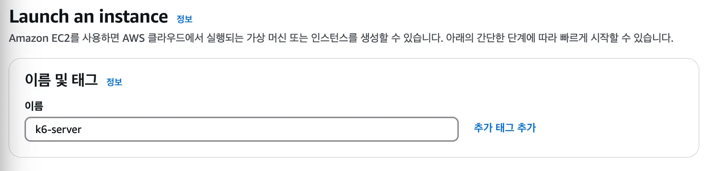
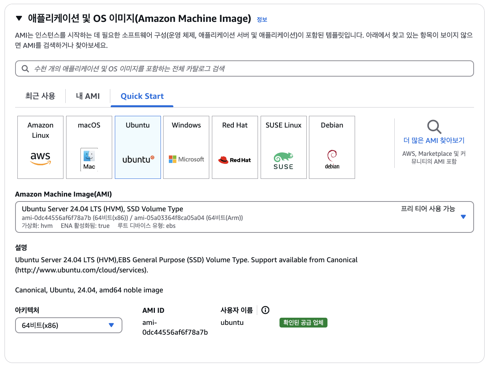
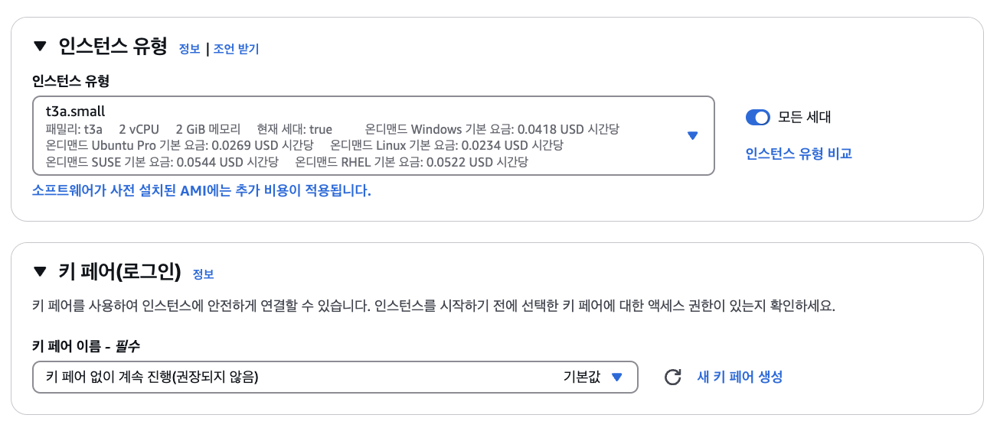
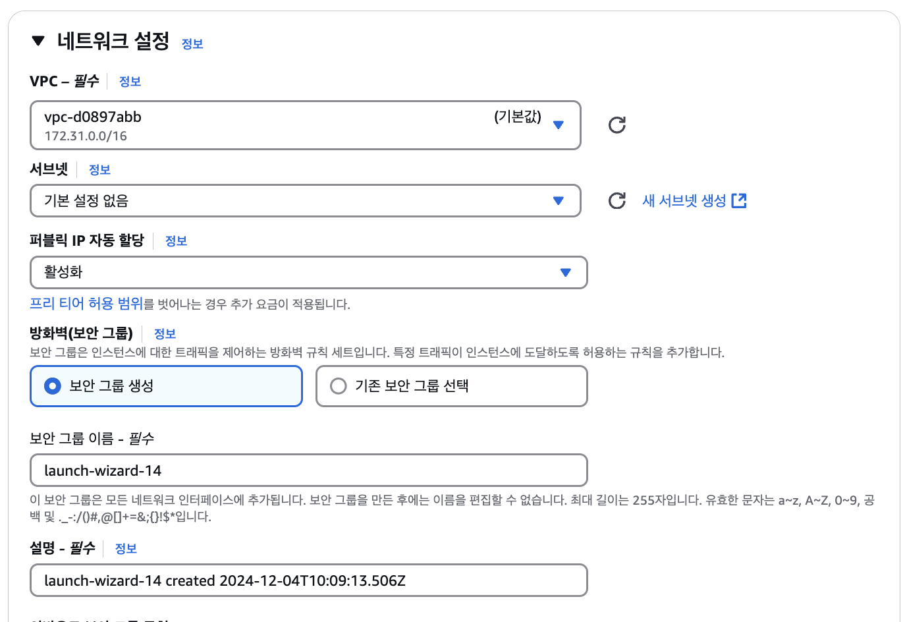
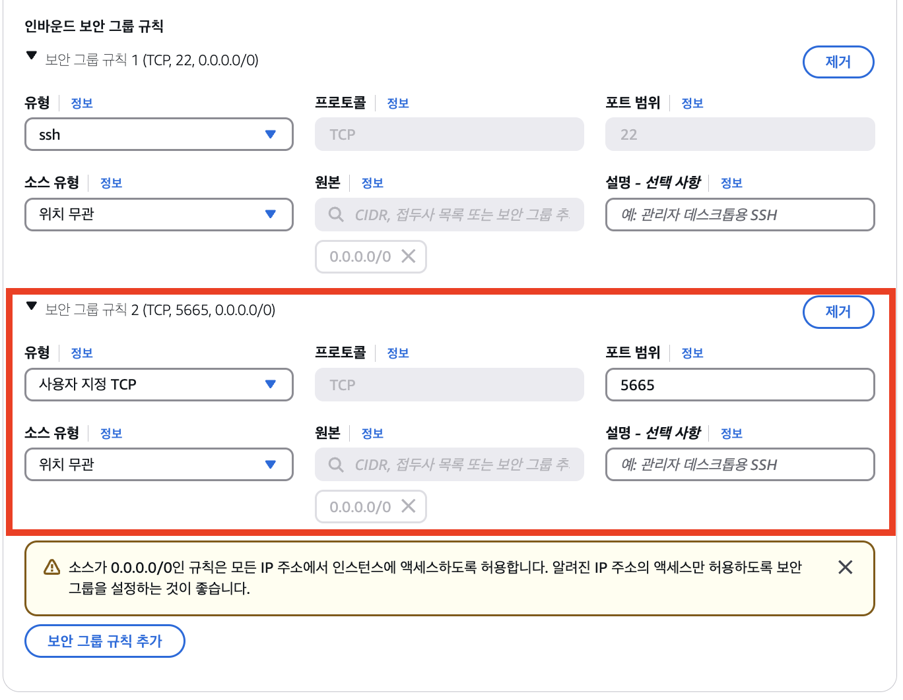
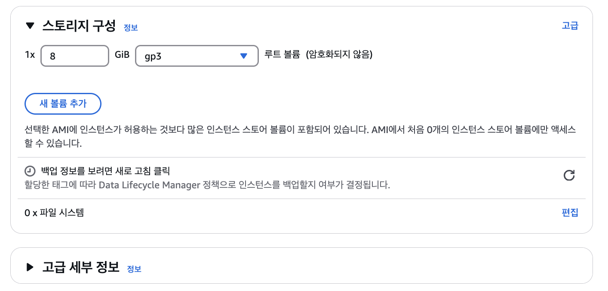
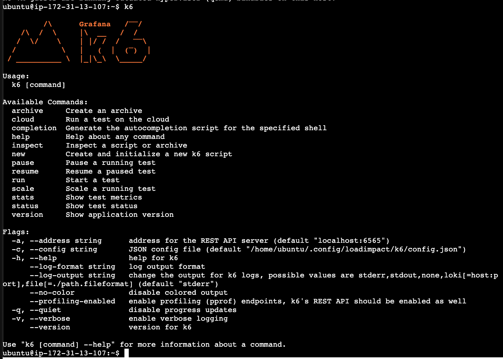
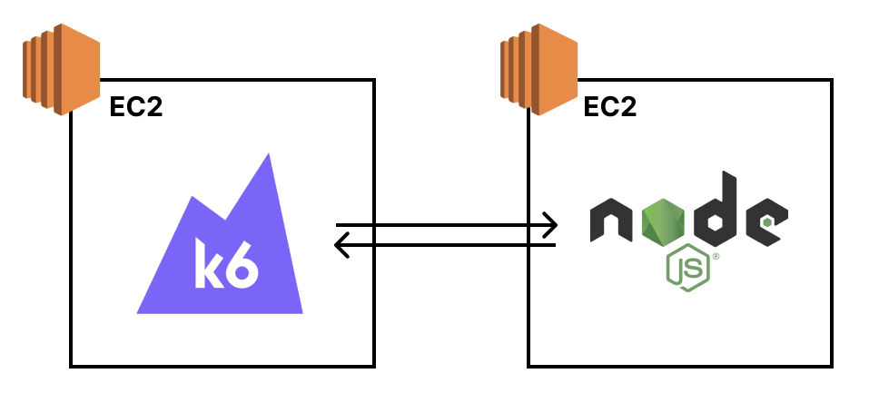

## EC2 생성

충분한 부하를 만들어내기 위해 t3a.small로 생성합니다.









## 부하테스트 Tool(K6) 설치
1) 설치 하기
```shell
$ sudo gpg -k && /
sudo gpg --no-default-keyring --keyring /usr/share/keyrings/k6-archive-keyring.gpg --keyserver hkp://keyserver.ubuntu.com:80 --recv-keys C5AD17C747E3415A3642D57D77C6C491D6AC1D69 && /
echo "deb [signed-by=/usr/share/keyrings/k6-archive-keyring.gpg] https://dl.k6.io/deb stable main" | sudo tee /etc/apt/sources.list.d/k6.list && /
sudo apt-get update && /
sudo apt-get install k6
```

2) 설치 확인
```shell
$ k6
```



### ✅ 주의점

1. **부하 테스트 환경 독립적으로 분리**

   부하 테스트 툴(k6)은 테스트하고자 하는 시스템(백엔드, DB 등)과 반드시 독립적으로 분리해서 구성해야 한다. 왜냐면 부하 테스트 툴 자체도 트래픽을 만들어내면서 컴퓨팅 리소스(CPU, 메모리 등)를 사용하기 때문이다.

   

2. **부하 테스트 툴을 개인 컴퓨터에 설치하지 않기**

   개인이 가지고 있는 컴퓨터는 Windows 또는 Mac OS일텐데, 컴퓨터 자체적으로 부하를 발생시킬 때 제한이 걸릴 때가 종종 있다. 따라서 EC2 인스턴스를 생성해 Linux 환경에서 부하 테스트를 진행할 것을 권장한다.


**참고**
* [K6를 이용한 서버 성능 테스트 이슈](https://san-tiger.tistory.com/entry/K6%EB%A5%BC-%EC%9D%B4%EC%9A%A9%ED%95%9C-%EC%84%9C%EB%B2%84-%EC%84%B1%EB%8A%A5-%ED%85%8C%EC%8A%A4%ED%8A%B8-%EC%9D%B4%EC%8A%88)
* [K6는 맥에서 돌리지 마세요...... 제발(connection reset by peer)](https://kinggodgeneral.tistory.com/72)
