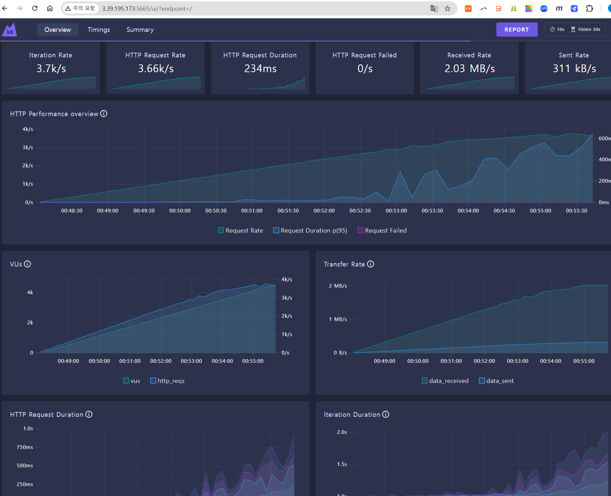

**1) 스크립트 작성**

[공식문서](https://grafana.com/docs/k6/latest/)를 참조해 부하테스트를 진행하기 위한 `script.js` 를 작성 합니다.   
주소에 앞서 만들어둔 API 주소를 입력하도록 합니다.

```js
import http from 'k6/http';
import { sleep } from 'k6';

export const options = {
  // 부하를 생성하는 단계(stages)를 설정
  stages: [
    // 10분에 걸쳐 vus(virtual users, 가상 유저수)가 6000에 도달하도록 설정
    { duration: '10m', target: 6000 }
  ],
};

export default function () {
  // API 주소로 GET 요청
  http.get('http://{EC2 IP 주소}/boards');
  // 1초 휴식
  sleep(1);
}
```

**2) 부하 테스트 시작**

```shell
$ K6_WEB_DASHBOARD=true k6 run script.js
```


**3) 대시보드 확인**

k6는 진행 중인 test에 대해 대시보드를 제공 합니다.  
`http://{k6가 실행되고 있는 EC2 IP 주소}:5665` 으로 접속 합니다.
