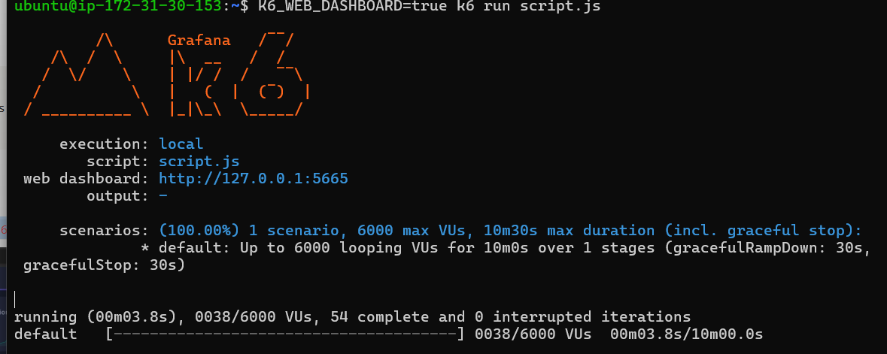
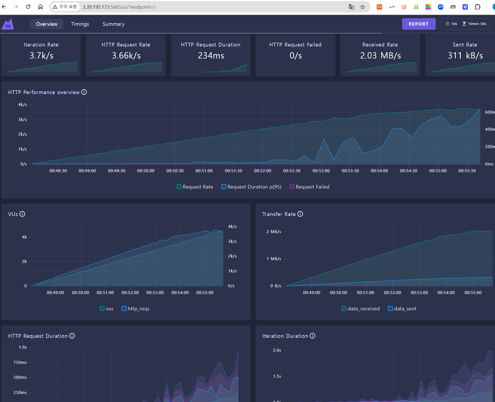
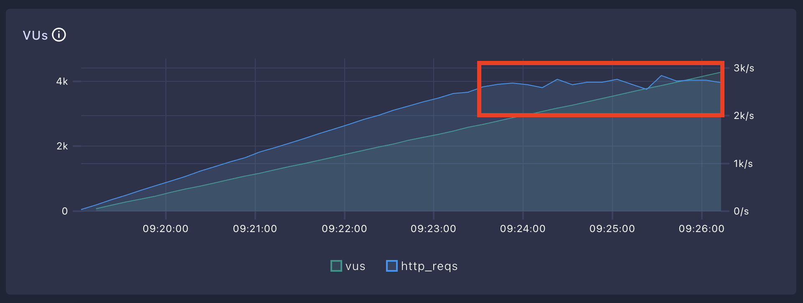
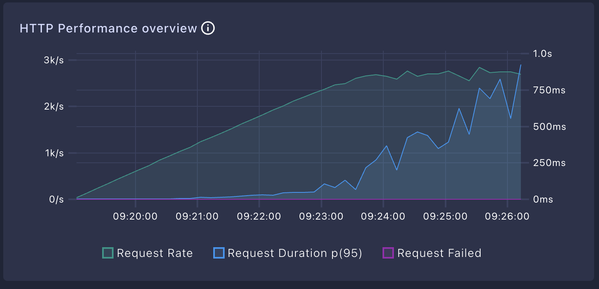
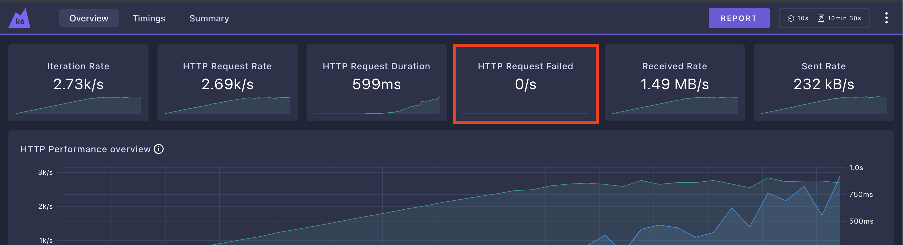

**1) 스크립트 작성**

[공식문서](https://grafana.com/docs/k6/latest/)를 참조해 부하테스트를 진행하기 위한 `script.js` 를 작성 합니다.   
주소에 앞서 만들어둔 API 주소를 입력하도록 합니다.

```js
import http from 'k6/http';
import { sleep } from 'k6';

export const options = {
  // 부하를 생성하는 단계(stages)를 설정
  stages: [
    // 10분에 걸쳐 vus(virtual users, 가상 유저수)가 6000에 도달하도록 설정
    { duration: '10m', target: 6000 }
  ],
};

export default function () {
  // API 주소로 GET 요청
  http.get('http://{EC2 IP 주소}/boards');
  // 1초 휴식
  sleep(1);
}
```

**2) 부하 테스트 시작**

```shell
$ K6_WEB_DASHBOARD=true k6 run script.js
```



**3) 대시보드 확인**

k6는 진행 중인 test에 대해 대시보드를 제공 합니다.  
`http://{k6가 실행되고 있는 EC2 IP 주소}:5665` 으로 접속 합니다.



### ✅ 부하 테스트 결과 해석 방법

k6의 웹 대시보드에서 부하 테스트 결과를 보면 수치가 너무 많아 복잡하게 느껴질 수 있다. 하지만 OT 때 얘기했던 파레토의 법칙에 따라 딱 3가지 수치만 확인하면 된다.

1. **HTTP Request Rate**

   **1초당 처리한 요청 수**를 의미한다. 즉, **Throughput(처리량)**을 나타내는 값이다.

2. **HTTP Request Duration**

   **요청에 대한 평균 응답 시간**을 의미한다. 즉, **Latency(지연 시간)**을 나타내는 값이다.

3. **HTTP Request Failed**

   **1초당 요청 실패 수**를 의미한다. 요청 실패가 발생한다면 어떤 문제로 인해 요청이 실패하는 지 체크해봐야 하는 신호이다.


### ✅ 실제 해석 순서

1. **VUs가 늘어나도 HTTP Request Rate가 더 이상 증가하지 않는 구간을 찾는다.**

   - 더 이상 증가하지 않는 HTTP Request Rate가 현재 시스템의 최대 Throughput이다. 
   - 초당 2,700개 정도의 요청을 처리하고 있다. 
   - 즉, 현재 시스템은 1초당 2,700개의 요청을 처리할 수 있다는 뜻이다. 
   - 이걸 보고 ‘**현재 시스템의 최대 Throughput은 2,700 TPS**’라고 표현한다.

   

2. **HTTP Request Duration이 비이상적으로 높은 건 아닌지 체크한다.**

   - 요청 당 응답 시간(Latency)이 비이상적으로 높을 경우 문제가 있는 건 아닌 지 체크해봐야 한다. 
   - 여기서 ‘비이상적’의 기준은 정하기 나름이다. 
   - 특정 서비스에서 응답 시간이 1초가 넘어가는 순간 사용자 이탈률이 크게 증가한다면, 정상적인 응답 시간 기준을 1초로 잡으면 된다.

    

   **참고)**    
   VUs가 높아짐에 따라 서버가 처리할 수 있는 요청량이 밀려서 대기하는 시간이 늘어나기 때문에, HTTP Request Rate(= Throughput)는 늘어나지 않는데 Request Duration(Latency)는 늘어나는 현상을 확인할 수 있다.

3. **HTTP Request Failed가 있는 건 아닌지 체크한다.**

   - 만약 실패한 요청이 있다면 요청이 왜 실패했는 지 분석해야 한다.

   